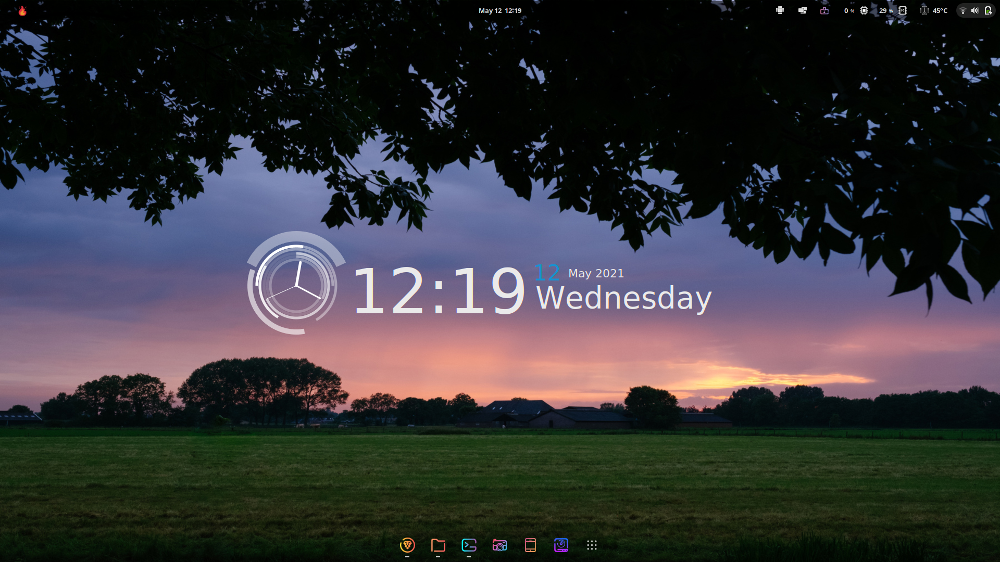

# blueconky
A basic conky setup I use on my system.


# Install
Installation is straighforward. Install the [conky-cairo](https://github.com/brndnmtthws/conky) package. The make a `.conky` folder in your home directory and place the `conkyrc` and `conky-dashboard.lua` files in it. Then run
```
conky -c ~/.conky/conkyrc 
```

# Others
If you want to know about rest of the theming, here's a list - 
- [Wallpaper](https://gist.github.com/dkodar20/f8ce656476b4ae0f39ae33676fb61a25)
- [Orchis Dark Compact Shell](https://www.gnome-look.org/p/1357889/)
- [Sweet Theme](https://www.gnome-look.org/p/1253385/)
- [Candy Icons](https://www.gnome-look.org/p/1305251/)
- [Manjaro | Gnome](https://manjaro.org/get-manjaro/#gnome)
